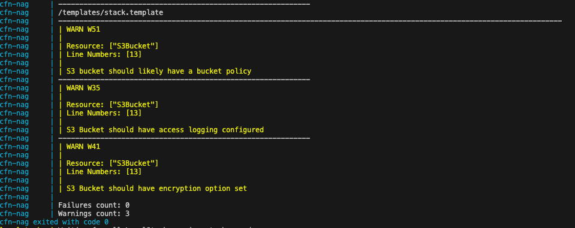

# Cloudformation assignment

The cfn-nag flagged three warnings in the CF template:

 

- The bucket lacks a Bucket Policy.
- Encryption for the bucket is not enabled.
- Access logs are not enabled.

To address these issues, the following changes were made in the code:

- Bucket Policy:
  The BucketPolicy resource applies a policy to the S3 bucket (MyS3Bucket) to enforce additional security controls:
  - DenyUnEncryptedObjectUploads: 
    Denies unencrypted object uploads to the bucket. This policy statement ensures that all objects uploaded to the bucket are encrypted with server-side encryption.
  - DenyInsecureConnections: 
    Denies insecure connections to the bucket. This policy statement ensures that all connections to the bucket are made over secure channels.
- Logs:
  Access logs for the S3 bucket are enabled and directed to the a specific bucket. The logs are prefixed with s3-access-logs/.
- Bucket Encryption:
  The BucketEncryption property of the MyS3Bucket resource configures server-side encryption with AES256 algorithm. This ensures that objects stored in the S3 bucket are encrypted at rest, enhancing data security.
- Public Access Block:
  The PublicAccessBlockConfiguration property of the MyS3Bucket resource is set to block public access to the bucket. This ensures that the S3 bucket does not allow any public access, thereby preventing unauthorized access to objects stored within the bucket.

